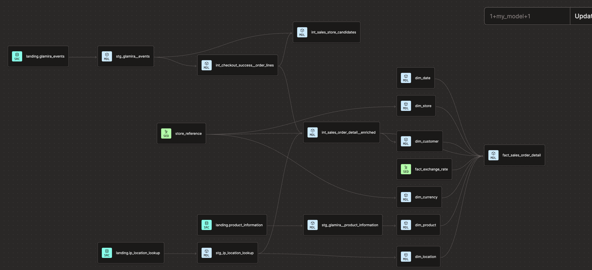

# Glamira Data Transformation and Visualisation

## Overview

This project builds an analytics-ready sales data mart for Glamira using **dbt** and **Amazon Redshift**. It transforms raw event, product, and IP-location data into clean staging models, enriched sales records, and a star schema suitable for reporting and visualisation.

## Data pipeline

The project follows four main layers:

1. **Landing** – raw Glamira events, product information, and IP-location data are loaded into Redshift.
2. **Staging** – source fields are cleaned, renamed, and cast to consistent data types.
3. **Intermediate** – checkout events are expanded into order lines and enriched with store and location details.
4. **Mart** – dimensional tables and the sales fact table are created for analytics.

Reference data for stores and exchange rates is loaded through dbt seeds.

## dbt lineage



The final `fact_sales_order_detail` model combines sales data with the following dimensions:

- `dim_date`
- `dim_store`
- `dim_customer`
- `dim_currency`
- `dim_product`
- `dim_location`

## Project structure

```text
.
├── dbt/
│   ├── macros/              # Reusable dbt macros
│   ├── models/
│   │   ├── staging/         # Clean source models
│   │   ├── intermediate/    # Business transformations and enrichment
│   │   └── marts/           # Fact and dimension models
│   └── seeds/               # Store and exchange-rate reference data
├── docs/images/             # Project documentation images
└── sql/
    ├── redshift/landing/    # Landing-table load scripts
    └── validation/          # Layer validation queries
```

## Getting started

### Prerequisites

- Python 3.13 or later
- `uv`
- Access to an Amazon Redshift database
- A valid dbt `profiles.yml` configuration using the `default` profile

### Run the project

```bash
uv sync --group dev
cd dbt
uv run dbt deps
uv run dbt debug
uv run dbt seed
uv run dbt build
```

## Main output

The main analytics table is `fact_sales_order_detail`, which provides order-line-level sales measures and dimension keys for downstream reporting and visualisation.
